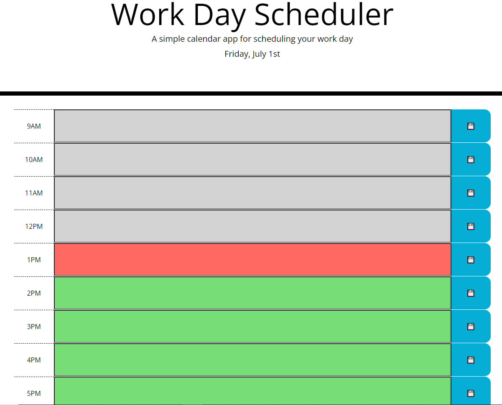

# Work Day Scheduler

## Description
This web application is a simple scheduler which helps organize tasks during a given work day. Given time blocks for an average work day, users can fill in with planned events for day and save them so they load even when the browser is reloaded. Time blocks are colored to represent if the time block is in the past, is currently ongoing, or will occur in the future. 

This project uses third-party api such as moment.js, bootstrap, and jquery. It is a benchmark piece for my current abilties with intigration of third-party api.

## Deployed Site

## Deployed Site Link
[Portfolio Website](https://hmanjun.github.io/Portfolio-page/)

## License
[Link](https://github.com/hmanjun/horiseon-refactor/blob/main/LICENSE)
